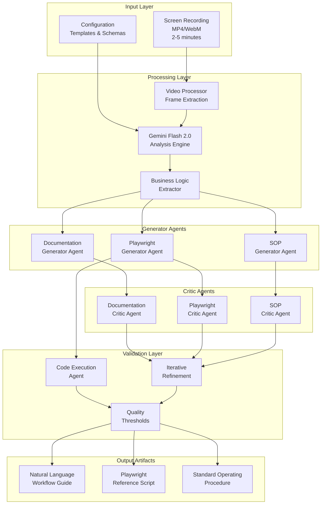
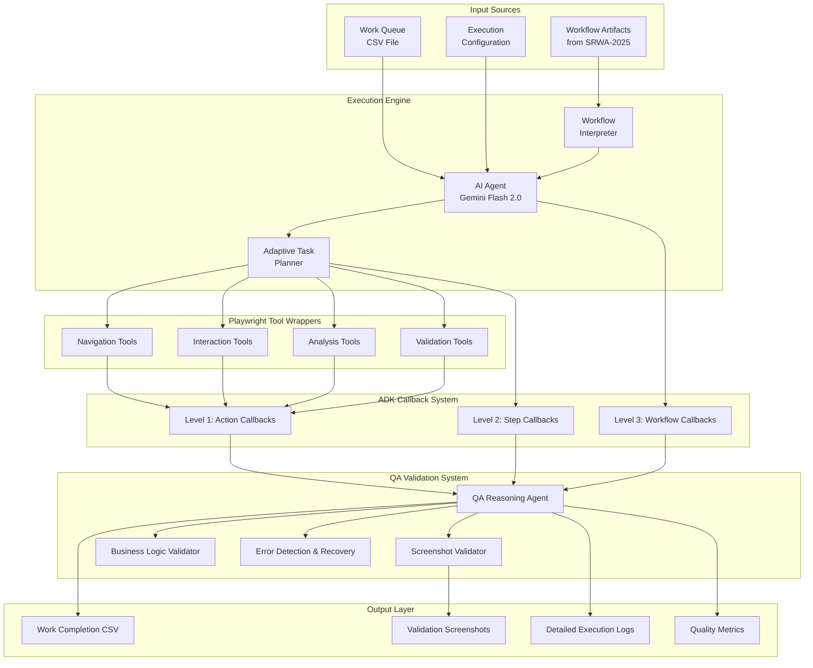

# Agent Workflow Suite

[](https://www.python.org/downloads/)
[](https://opensource.org/licenses/MIT)
[](https://github.com/psf/black)

> **AI-Powered Browser Workflow Automation Suite**  
> Transform screen recordings into intelligent workflow automation with built-in quality assurance and comprehensive audit trails.

## 🎯 Project Overview

The Agent Workflow Suite is a comprehensive AI-powered system that revolutionizes browser workflow automation through intelligent analysis and execution. The suite consists of two interconnected components that work together to capture, analyze, and execute complex browser-based workflows with human-level intelligence and decision-making capabilities.

### Core Components

1. **[Screen Recording Workflow Analyzer](#-screen-recording-workflow-analyzer)** - Transforms 2-5 minute browser recordings into structured AI training data
2. **[AI Workflow Execution Agent](#-ai-workflow-execution-agent)** - Executes workflows intelligently using the generated training data with built-in QA validation

## 🎥 Screen Recording Workflow Analyzer

### Purpose
Converts browser workflow screen recordings into three structured artifacts designed for AI agent consumption, capturing both technical steps and business decision logic.

### Key Features
- **Multimodal Video Analysis** using Gemini Flash 2.0
- **Business Logic Extraction** - Captures the "why" behind decisions, not just the "what"
- **Quality Assurance System** with automated validation and iterative refinement
- **Three-Artifact Output** optimized for downstream AI agents

### Generated Artifacts

#### 1. Playwright Reference Script
- **Purpose**: Technical automation foundation for AI agents
- **Format**: Python script with extensive comments
- **Contents**: Browser interactions, element selection patterns, workflow structure
- **Usage**: Starting point for AI agents with Playwright automation tools

#### 2. Natural Language Workflow Guide
- **Purpose**: Human-readable description with business context
- **Format**: Structured text with embedded metadata
- **Contents**: 
  - Step-by-step process descriptions with timestamps
  - Business decision criteria and logic
  - Intent classification for each action
  - Context clues and conditional information
  - Expected outcomes and validation points

#### 3. Standard Operating Procedure (SOP)
- **Purpose**: Compliance documentation using industry templates
- **Format**: Markdown following established standards (ISO 9001, ITIL, COSO)
- **Contents**: 
  - Process overview and business objectives
  - Detailed procedures with decision criteria
  - Quality checkpoints and business rules
  - Exception handling and escalation procedures

### Architecture



## 🤖 AI Workflow Execution Agent

### Purpose
Intelligently executes browser workflows using artifacts from the Screen Recording Analyzer, processing CSV work queues with built-in QA validation and comprehensive audit trails.

### Key Features
- **Intelligent Workflow Execution** with Gemini Flash 2.0 reasoning
- **Adaptive Browser Automation** using Playwright tools
- **Real-time QA Validation** with callback-driven quality assurance
- **Comprehensive Audit Trails** for compliance and troubleshooting
- **Error Recovery** with intelligent retry and adaptation logic

### System Inputs
- **Workflow Artifacts** from Screen Recording Analyzer
- **Work Queue** (CSV file with items to process)
- **Configuration** (execution parameters and quality thresholds)

### System Outputs
- **Completion Report** (CSV with processed items and status)
- **Validation Artifacts** (screenshots, logs, URLs for audit verification)
- **Execution Log** (detailed action-by-action documentation)
- **Quality Metrics** (success rates, error patterns, performance data)

### ADK Callback System Integration

The system leverages Google ADK's three-level callback architecture:

#### Level 1: Action-Level Callbacks
- Automatic screenshot capture before/after browser actions
- Immediate validation of action completion
- Real-time error detection and response

#### Level 2: Step-Level Callbacks
- Workflow progress validation at logical checkpoints
- Business rule compliance verification
- QA agent reasoning triggers

#### Level 3: Workflow-Level Callbacks
- Final completion validation
- Comprehensive audit trail generation
- Quality metrics collection and reporting

### Architecture



## 🚀 Technology Stack

### Core Technologies
- **Python 3.12+** - Primary development language
- **Gemini Flash 2.0** - AI reasoning and multimodal analysis
- **Google AI Development Kit (ADK)** - AI platform and callback system
- **Playwright** - Browser automation framework
- **Ruff** - Code linting and formatting

### AI & ML
- **Multimodal Video Analysis** - Frame-by-frame workflow extraction
- **Business Logic Inference** - Decision pattern recognition
- **Intent Classification** - Understanding user motivations
- **Quality Validation** - Automated artifact assessment

### Infrastructure
- **Callback-Driven Architecture** - Event-driven quality assurance
- **Multi-Agent System** - Specialized agents for generation and validation
- **Iterative Refinement** - Automated improvement cycles
- **Comprehensive Logging** - Full audit trail generation

## 📋 Requirements

### System Requirements
- Python 3.12 or higher
- Google ADK access and credentials
- Gemini Flash 2.0 API access
- Minimum 8GB RAM (16GB recommended)
- Modern web browser (Chromium-based recommended)

### Input Specifications
- **Video Format**: MP4, WebM, or AVI
- **Duration**: 2-5 minutes optimal
- **Resolution**: Minimum 1280x720
- **Content**: Browser-based workflows only

## 🏗️ Project Structure

```
agent-workflow-suite/
├── docs/                           # Project documentation
│   └── prds/                      # Product Requirements Documents
│       ├── 01-screen-recording-analyzer/
│       │   ├── assets/            # Architecture diagrams and flows
│       │   └── prd-screen-recording-workflow-analyzer.md
│       └── 02-workflow-execution-agent/
│           ├── assets/            # System architecture and workflows
│           └── prd-ai-workflow-execution-agent.md
├── src/                           # Source code
│   └── agent_workflow_suite/      # Main package
│       └── __init__.py
├── pyproject.toml                 # Project configuration
├── .pre-commit-config.yaml        # Code quality hooks
├── .python-version                # Python version specification
└── README.md                      # This file
```

## 🎯 Success Metrics

### Technical Performance
- **Processing Time**: <10 minutes end-to-end for 5-minute recordings
- **Workflow Accuracy**: >90% correct step identification post-validation
- **Script Viability**: >85% of Playwright scripts execute without critical errors
- **AI Agent Success**: >85% of downstream agents successfully execute workflows

### Business Value
- **Intent Capture**: >80% accurate business decision pattern extraction
- **Time Savings**: Reduce workflow documentation time from hours to minutes
- **Knowledge Retention**: Capture business logic that would otherwise be lost
- **Audit Compliance**: Complete documentation trail for all executed work

## 🗓️ Implementation Timeline

### Phase 1: Foundation (Weeks 1-4)
- Video processing pipeline development
- Gemini Flash 2.0 integration
- Basic workflow step extraction
- Initial artifact generation framework

### Phase 2: Business Logic Engine (Weeks 5-8)
- Decision pattern analysis algorithms
- Intent classification system
- Context extraction capabilities
- Business rule inference

### Phase 3: Quality Assurance System (Weeks 9-12)
- Code execution validation
- Multi-agent critique system
- Iterative refinement implementation
- Performance optimization

### Phase 4: Execution Agent Development (Weeks 13-16)
- Workflow execution engine
- ADK callback integration
- QA validation system
- Audit trail generation

### Phase 5: Integration & Testing (Weeks 17-20)
- End-to-end pipeline integration
- Real-world workflow validation
- Performance tuning
- Deployment preparation

## 🔒 Quality Assurance

### Built-in Quality Features
- **Automated Validation**: Multi-agent critique system with quality thresholds
- **Code Execution Testing**: Static analysis and mock execution validation
- **Iterative Refinement**: Automatic improvement cycles (default 3 iterations)
- **Real-time QA**: Callback-driven validation during workflow execution

### Quality Gates
- All artifacts must pass automated validation before output
- Business logic extraction must achieve minimum confidence scores (>80%)
- Generated procedures must comply with selected industry templates
- Code execution validation must confirm script structural integrity

## 🤝 Contributing

This project follows strict git conventions and code quality standards:

- **Commit Messages**: Follow Conventional Commits specification
- **Code Style**: Enforced via Ruff and pre-commit hooks
- **Testing**: Comprehensive test coverage required
- **Documentation**: All features must be properly documented

See our [Git Conventions](docs/git-conventions.md) for detailed guidelines.

## 📄 License

This project is licensed under the MIT License - see the [LICENSE](LICENSE) file for details.

## 🆘 Support

For questions, issues, or contributions:

1. Check existing [Issues](../../issues)
2. Review [Documentation](docs/)
3. Create new issue with detailed description
4. Follow our contribution guidelines

---

**Built with ❤️ for intelligent workflow automation**
