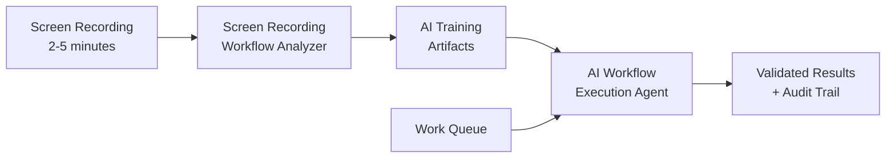

# Agent Workflow Suite

[](https://www.python.org/downloads/)
[](https://opensource.org/licenses/MIT)
[](https://github.com/astral-sh/ruff)
[](https://ai.google.dev/gemini-api/docs/models#gemini-2.0-flash)

> **Enterprise AI-Powered Browser Workflow Automation Suite**  
> Transform screen recordings into intelligent workflow automation with built-in quality assurance and comprehensive audit trails.

## 🎯 What This Does

The Agent Workflow Suite captures institutional knowledge from browser workflows and operationalizes it through intelligent AI agents. It solves the critical gap between manual process documentation and reliable automation by preserving both **technical steps** and **business decision logic**.

**The Problem**: Organizations lose valuable workflow knowledge when employees leave, and traditional automation tools miss the "why" behind decisions.

**Our Solution**: AI agents that understand both what to do and why to do it, with built-in quality assurance and complete audit trails.

## 🏗️ System Overview



### Two-Component Architecture

1. **[Screen Recording Workflow Analyzer](docs/prds/01-screen-recording-analyzer/)** - Transforms browser recordings into structured AI training data
2. **[AI Workflow Execution Agent](docs/prds/02-workflow-execution-agent/)** - Executes workflows intelligently with built-in QA validation

## ✨ Key Features

### 🧠 **Business Logic Capture**
- Extracts decision patterns and intent, not just clicks
- Preserves organizational knowledge and procedures
- Generates compliance-ready documentation

### 🔍 **Multi-Agent Quality Assurance**
- Generator agents create artifacts, critic agents validate them
- Iterative refinement with quality thresholds (>85% accuracy)
- Code execution validation using Google ADK

### 🤖 **Intelligent Execution**
- ADK callback-driven validation at action, step, and workflow levels
- Adaptive error recovery with business rule consultation
- Real-time QA agent monitoring and correction

### 📋 **Complete Audit Trails**
- Screenshot documentation at every step
- Business rule compliance verification
- Regulatory-ready audit packages

## 🚀 Technology Stack

- **AI Platform**: Google ADK + Gemini Flash 2.0
- **Automation**: Playwright Python with adaptive selectors
- **Language**: Python 3.12+ with async/await patterns
- **Quality**: Multi-agent validation with callback system
- **Compliance**: Automated audit trail generation

## 📋 Requirements

### System Requirements
- Python 3.12+
- Google ADK access and Gemini Flash 2.0 API
- 8GB RAM minimum (16GB recommended)
- Modern browser (Chromium-based preferred)

### Input Specifications
- **Video**: MP4/WebM, 2-5 minutes, 1280x720+ resolution
- **Content**: Browser-based workflows only
- **Quality**: Clear UI interactions with minimal interruptions

## 🎯 Success Metrics

- **Processing**: <10 minutes for 5-minute recordings
- **Accuracy**: >90% workflow step identification
- **Execution**: >85% script success rate
- **Business Value**: >75% reduction in manual workflow time

## 📁 Project Structure

```
agent-workflow-suite/
├── docs/prds/                    # Detailed product requirements
│   ├── 01-screen-recording-analyzer/
│   └── 02-workflow-execution-agent/
├── src/agent_workflow_suite/     # Source code (coming soon)
├── pyproject.toml               # Project configuration
└── README.md                   # This file
```

## 📖 Documentation

- **[Screen Recording Analyzer PRD](docs/prds/01-screen-recording-analyzer/prd-screen-recording-workflow-analyzer.md)** - Complete requirements and architecture
- **[Workflow Execution Agent PRD](docs/prds/02-workflow-execution-agent/prd-ai-workflow-execution-agent.md)** - Execution system specifications
- **[Architecture Overview](docs/prds/01-screen-recording-analyzer/assets/architecture-overview.md)** - System design and components
- **[Implementation Phases](docs/prds/01-screen-recording-analyzer/assets/implementation-phases.md)** - Development timeline and milestones

## 🗓️ Development Status

**Current Phase**: Initial setup and documentation  
**Timeline**: 28-week development cycle  
**Next Milestone**: Foundation infrastructure (Weeks 1-4)

See [Implementation Phases](docs/prds/01-screen-recording-analyzer/assets/implementation-phases.md) for detailed roadmap.

## 🤝 Contributing

This project follows strict development standards:

- **Commits**: [Conventional Commits](https://conventionalcommits.org/) specification
- **Code Quality**: Ruff formatting and linting with pre-commit hooks
- **Git Workflow**: Feature branches → develop → main with required reviews
- **Testing**: Comprehensive coverage with quality gates

See our git rules: `fetch_rules git-conventions` in your development environment.

## 📄 License

MIT License - see [LICENSE](LICENSE) for details.

## 🆘 Support

- **Issues**: [GitHub Issues](../../issues) for bugs and feature requests
- **Documentation**: See [docs/](docs/) for detailed specifications
- **Questions**: [GitHub Discussions](../../discussions) for community support

---

**🚀 Transforming workflow automation through AI-powered institutional knowledge capture** 