# Agent Workflow Suite

[](https://www.python.org/downloads/)
[](https://opensource.org/licenses/MIT)
[](https://github.com/astral-sh/ruff)
[](https://ai.google.dev/gemini-api/docs/models#gemini-2.0-flash)

> **Enterprise-Grade AI-Powered Browser Workflow Automation Suite**  
> Transform screen recordings into intelligent workflow automation with multi-agent quality assurance, comprehensive audit trails, and callback-driven execution validation.

## 🎯 Executive Summary

The Agent Workflow Suite revolutionizes enterprise workflow automation through a two-component AI system that captures, analyzes, and executes complex browser-based workflows with human-level intelligence. The suite addresses the critical gap between manual process documentation and intelligent automation by preserving both technical steps AND business decision logic.

### Business Value Proposition
- **🚀 Acceleration**: Reduce workflow documentation time from hours to minutes
- **🧠 Intelligence**: Capture business logic that traditional automation misses
- **🔍 Quality**: Built-in multi-agent validation with >95% accuracy targets
- **📋 Compliance**: Complete audit trails for regulatory requirements
- **💰 ROI**: >75% reduction in manual workflow execution time

## 🏗️ System Architecture Overview

The suite consists of two interconnected AI systems working in tandem:


---

## 🎥 Component 1: Screen Recording Workflow Analyzer

### Purpose & Scope
Transforms browser workflow screen recordings into three structured AI training artifacts, capturing both technical automation steps and business decision logic through advanced multimodal analysis.

### Core Innovation: Business Logic Extraction
Unlike traditional screen recording tools that only capture clicks and keystrokes, this system extracts:
- **Decision Pattern Recognition**: Why users make specific choices
- **Intent Classification**: Understanding the purpose behind each action
- **Context Analysis**: Environmental factors influencing decisions
- **Business Rule Inference**: Deriving organizational procedures from observed behavior

### Multi-Agent Architecture


### Generated Artifacts

#### 1. Natural Language Workflow Guide
**Purpose**: Human-readable workflow description with embedded business intelligence
- **Format**: Structured text with metadata tags
- **Content**: 
  - Step-by-step process descriptions with precise timestamps
  - Business decision criteria and conditional logic
  - Intent classification for each user action
  - Environmental context and situational factors
  - Expected outcomes and success validation points
  - Exception handling and alternative pathways

#### 2. Playwright Reference Script
**Purpose**: Technical automation foundation with intelligent adaptation capabilities
- **Format**: Python script with extensive contextual comments
- **Content**:
  - Browser interaction patterns with multiple selector strategies
  - Element identification with fallback mechanisms
  - Workflow structure with business logic integration
  - Error handling and recovery procedures
  - Dynamic adaptation hints for UI variations

#### 3. Standard Operating Procedure (SOP)
**Purpose**: Compliance-ready documentation following industry standards
- **Format**: Markdown following ISO 9001, ITIL, COSO frameworks
- **Content**:
  - Process overview with business objectives
  - Detailed procedures with decision criteria
  - Quality checkpoints and validation requirements
  - Business rules and compliance requirements
  - Exception handling and escalation procedures
  - Audit trail requirements and documentation standards

### Quality Assurance System

#### Multi-Agent Validation Framework

**Generator Agents**:
- **Documentation Generator**: Creates natural language workflow descriptions with business context
- **Playwright Generator**: Produces automation scripts with intelligent adaptation capabilities  
- **SOP Generator**: Builds compliance documentation following industry templates

**Critic Agents**:
- **Documentation Critic**: Validates accuracy, completeness, and clarity of workflow descriptions
- **Playwright Critic**: Reviews script structure, reliability, and automation best practices
- **SOP Critic**: Ensures compliance with industry standards and organizational requirements

**Specialized Agents**:
- **Code Execution Agent**: Tests script viability using ADK interpreter tools with mock execution
- **Quality Manager**: Monitors thresholds and manages convergence criteria
- **Orchestrator Agent**: Coordinates all agent interactions and maintains workflow state

#### Agent Communication Protocols
**Message Types**:
- **Task Assignment**: Orchestrator → Generator/Critic with specific requirements
- **Artifact Delivery**: Generator → Orchestrator with confidence scores
- **Critique Feedback**: Critic → Orchestrator → Generator with actionable improvements
- **Quality Assessment**: Quality Manager → Orchestrator with threshold compliance
- **Refinement Request**: Orchestrator → Generator with specific feedback integration

**Quality Metrics Exchange**:
- **Confidence Scores**: 0.0 - 1.0 scale for each artifact with detailed breakdown
- **Issue Categories**: Critical, Major, Minor classification with priority levels
- **Improvement Suggestions**: Specific actionable feedback with implementation guidance
- **Validation Evidence**: Screenshots, logs, test results supporting quality assessments

#### Iterative Refinement Process
- **Quality Thresholds**: Configurable acceptance criteria (default 85% confidence)
- **Refinement Cycles**: Maximum 3 improvement iterations per artifact
- **Convergence Tracking**: Monitor improvement progression and success rates
- **Evidence Collection**: Maintain detailed logs of refinement decisions and improvements

### Technical Specifications

#### Core Technology Stack
- **AI Model**: Gemini Flash 2.0 for multimodal video analysis
- **Platform**: Google AI Development Kit (ADK) with interpreter tools
- **Processing**: Frame-by-frame analysis at 1-2 FPS sampling rate
- **Input Requirements**: MP4/WebM recordings, 2-5 minutes, minimum 1280x720 resolution

#### Performance Targets
- **Processing Time**: <10 minutes end-to-end for 5-minute recordings
- **Workflow Accuracy**: >90% correct step identification post-validation
- **Script Viability**: >85% of generated Playwright scripts execute without critical errors
- **Business Logic Capture**: >80% accurate decision pattern extraction

---

## 🤖 Component 2: AI Workflow Execution Agent

### Purpose & Innovation
Intelligently executes browser workflows using training artifacts from the Screen Recording Analyzer, processing CSV work queues with built-in QA validation and comprehensive audit trails through ADK's three-level callback architecture.

### ADK Callback-Driven Architecture

The system leverages Google ADK's three-level callback system for automated quality assurance and audit trail generation:

#### Level 1: Action-Level Callbacks (@callback.on_action)
**Automatic Operations**:
- Screenshot capture before/after each browser action
- Real-time validation of action success  
- Error detection and immediate response
- Action logging with context and results

```python
@callback.on_action(trigger="before")
def pre_action_callback(context):
    screenshot_path = take_screenshot(f"before_{context.action_name}")
    current_state = validate_page_state()
    log_action_intent(context.action_name, context.parameters)
    
    return {
        "screenshot": screenshot_path,
        "state_valid": current_state.is_valid,
        "ready_for_action": True
    }
```

#### Level 2: Step-Level Callbacks (@callback.on_step)  
**Quality Checkpoints**:
- Workflow progress validation at logical milestones
- Business rule compliance verification
- QA agent reasoning triggers
- Step-level error recovery coordination

#### Level 3: Workflow-Level Callbacks (@callback.on_workflow)
**Comprehensive Validation**:
- Final workflow completion verification
- Complete audit trail generation
- Quality metrics collection and reporting
- Evidence package compilation for compliance


### Callback System Integration

#### Level 1: Action-Level Callbacks (@callback.on_action)
**Automatic Operations**:
- Screenshot capture before/after each browser action
- Real-time validation of action success
- Error detection and immediate response
- Action logging with context and results

```python
@callback.on_action(trigger="before")
def pre_action_callback(context):
    screenshot_path = take_screenshot(f"before_{context.action_name}")
    current_state = validate_page_state()
    log_action_intent(context.action_name, context.parameters)
    
    return {
        "screenshot": screenshot_path,
        "state_valid": current_state.is_valid,
        "ready_for_action": True
    }
```

#### Level 2: Step-Level Callbacks (@callback.on_step)
**Quality Checkpoints**:
- Workflow progress validation at logical milestones
- Business rule compliance verification
- QA agent reasoning triggers
- Step-level error recovery coordination

#### Level 3: Workflow-Level Callbacks (@callback.on_workflow)
**Comprehensive Validation**:
- Final workflow completion verification
- Complete audit trail generation
- Quality metrics collection and reporting
- Evidence package compilation for compliance

### QA Validation System

#### QA Reasoning Agent
Central intelligence coordinating validation activities with specialized components:

**Core Responsibilities**:
- **Context Management**: Maintain awareness of workflow state and business requirements
- **Validation Orchestration**: Coordinate between visual, business, and error validation
- **Decision Making**: Determine success/failure and recovery strategies  
- **Quality Scoring**: Assign confidence scores to validation results

#### Screenshot Validator
Specialized visual verification system:
- **State Comparison**: Before/after screenshot analysis with difference detection
- **Element Detection**: Verify presence and state of expected UI elements
- **Content Validation**: OCR-based text and data verification
- **Error Identification**: Visual detection of error messages and unexpected states

#### Business Validator  
Ensures compliance with documented procedures:
- **Procedure Compliance**: Verify steps follow documented SOP requirements
- **Decision Logic Validation**: Confirm business decisions match expected criteria
- **Authorization Workflows**: Validate proper approval and escalation procedures
- **Data Integrity**: Ensure data processing follows organizational business rules

#### Error Recovery System
Intelligent error detection and recovery:


#### Screenshot Validator
Specialized visual verification system:
- **State Comparison**: Before/after screenshot analysis with difference detection
- **Element Detection**: Verify presence and state of expected UI elements
- **Content Validation**: OCR-based text and data verification
- **Error Identification**: Visual detection of error messages and unexpected states

#### Business Validator
Ensures compliance with documented procedures:
- **Procedure Compliance**: Verify steps follow documented SOP requirements
- **Decision Logic Validation**: Confirm business decisions match expected criteria
- **Authorization Workflows**: Validate proper approval and escalation procedures
- **Data Integrity**: Ensure data processing follows organizational business rules

### Intelligent Error Recovery

#### Error Classification & Recovery Matrix

```mermaid
graph TD
    ERROR[Error Detected] --> CLASSIFY{Error Type}
    CLASSIFY -->|Technical| TECH[Technical Error<br/>• Retry with fixes<br/>• Timing adjustments]
    CLASSIFY -->|Business| BIZ[Business Logic Error<br/>• Consult SOPs<br/>• Alternative paths]
    CLASSIFY -->|UI| UI[UI Change Error<br/>• Adaptive selectors<br/>• Multiple strategies]
    CLASSIFY -->|Data| DATA[Data Validation Error<br/>• Format correction<br/>• Validation fixes]
    
    TECH --> SUCCESS{Recovery Success?}
    BIZ --> SUCCESS
    UI --> SUCCESS
    DATA --> SUCCESS
    
    SUCCESS -->|Yes| CONTINUE[Continue Workflow]
    SUCCESS -->|No| ESCALATE[Escalate for Manual Review]
```


#### Recovery Strategies
- **Adaptive Element Selection**: Multiple selector strategies with intelligent fallbacks
- **Timing Intelligence**: Dynamic wait times based on page behavior patterns
- **Business Logic Consultation**: Reference natural language guides for alternative approaches
- **QA-Guided Recovery**: AI-powered suggestions for corrective actions

### Comprehensive Audit Trail System

#### Evidence Collection Framework
- **Action-Level Evidence**: Screenshots and validation results for every browser interaction
- **Step-Level Summaries**: Business rule compliance verification and outcome documentation
- **Workflow-Level Reports**: Complete success/failure documentation with supporting evidence
- **Compliance Documentation**: Audit-ready packages meeting regulatory requirements

#### Detailed Output Structure
```
execution_results/
├── screenshots/
│   ├── ss_001_start.png
│   ├── ss_001_step2.png
│   └── ss_001_complete.png
├── logs/
│   ├── LOG_001_detailed.json
│   └── execution_summary.log
├── reports/
│   ├── completion_report.csv
│   └── quality_metrics.json
└── validation/
    ├── qa_assessments.json
    └── business_rule_compliance.log
```

#### Output Specifications

**Work Completion CSV Format**:
```csv
Item_ID,Status,Start_Time,End_Time,Screenshots,Validation_URLs,Log_Reference,QA_Score,Business_Rules_Applied,Notes
WI_001,Completed,2025-06-29 10:15:23,2025-06-29 10:18:45,"ss_001_start.png,ss_001_complete.png",https://app.com/ticket/12345,LOG_001,0.95,"approval_threshold_check,authorization_validation",Successfully processed approval workflow
```

**Detailed Execution Log Structure**:
```json
{
  "work_item_id": "WI_001",
  "workflow_name": "Approval Process",
  "execution_steps": [
    {
      "step_number": 1,
      "timestamp": "2025-06-29T10:15:23Z",
      "action": "navigate_to_url",
      "parameters": {"url": "https://app.com/approvals"},
      "result": "success",
      "screenshot": "ss_001_step1.png",
      "qa_validation": "Page loaded correctly, approval form visible",
      "business_rules_applied": ["url_validation", "form_presence_check"]
    }
  ],
  "final_status": "completed",
  "qa_assessment": {
    "overall_confidence": 0.95,
    "completion_verified": true,
    "issues_detected": []
  }
}
```

---

## 🚀 Technology Stack & Infrastructure

### Core AI Technologies
- **Gemini Flash 2.0**: Advanced multimodal analysis and reasoning
- **Google ADK**: AI development platform with callback system
- **Multi-Agent Orchestration**: Specialized agents for generation, critique, and validation
- **Computer Vision**: Screenshot analysis and UI element detection
- **Natural Language Processing**: Business logic extraction and intent classification

### Automation & Browser Technologies
- **Playwright Python**: Cross-browser automation with advanced capabilities
- **Adaptive Selectors**: Multiple element finding strategies with intelligent fallbacks
- **Screenshot Management**: Automated capture, labeling, and organization
- **State Management**: Browser session handling and cleanup

### Quality Assurance Infrastructure
- **Callback-Driven QA**: Event-triggered validation and audit trail generation
- **Iterative Refinement**: Automated improvement cycles with quality thresholds
- **Evidence Collection**: Comprehensive artifact generation for compliance
- **Performance Monitoring**: Real-time metrics and quality analytics

### Development & Deployment
- **Python 3.12+**: Modern Python with advanced type hints and performance
- **Ruff**: High-performance linting and code formatting
- **Pre-commit Hooks**: Automated linting, formatting, type checking, and testing
- **Structured Logging**: Comprehensive execution and audit logging

---

## 📋 System Requirements & Specifications

### Hardware Requirements
- **Minimum**: 8GB RAM, 4-core CPU, 50GB storage
- **Recommended**: 16GB RAM, 8-core CPU, 100GB SSD storage  
- **Enterprise**: 32GB RAM, 16-core CPU, 500GB NVMe storage

### Data Flow Pipeline Specifications
- **Frame Sampling**: Extract key frames at 1-2 FPS for optimal processing efficiency
- **Multimodal Processing**: Combine visual and audio analysis for comprehensive understanding
- **Structured Output**: JSON schema-compliant data extraction with validation
- **Quality Validation Flow**: Up to 3 iterative refinement cycles with convergence criteria
- **Code Validation**: Special handling for executable scripts with ADK interpreter testing

### Playwright Tool Wrappers
**Navigation Tools**:
- `navigate_to_url(url)`: Page navigation with load validation and redirect handling
- `wait_for_page_load()`: Intelligent page readiness detection with timeout management
- `handle_redirects()`: Automatic redirect following with validation

**Element Interaction Tools**:
- `find_element(selector_strategies)`: Multi-strategy element location with fallbacks
- `click_element(element, validation)`: Click with success confirmation and retry logic
- `type_text(element, text, validation)`: Text input with verification and error handling
- `select_option(element, value)`: Dropdown and select handling with validation
- `upload_file(element, file_path)`: File upload management with progress tracking

**Page Analysis Tools**:
- `take_screenshot(label)`: Capture and label page states with automatic organization
- `analyze_page_content()`: Extract relevant page information with business context
- `inventory_elements()`: Catalog interactive elements with accessibility information
- `check_for_errors()`: Detect error states and messages with classification
- `validate_completion_markers()`: Confirm workflow success indicators

### Software Dependencies
- **Python 3.12+** with modern async/await support
- **Google ADK** access and API credentials
- **Gemini Flash 2.0** API access with sufficient quotas
- **Modern web browser** (Chromium-based recommended)
- **Operating System**: Linux (preferred), macOS, Windows 10/11

### Input Specifications
- **Video Format**: MP4, WebM, AVI (H.264/H.265 codecs)
- **Duration**: 2-5 minutes optimal (system can handle longer with reduced performance)
- **Resolution**: Minimum 1280x720, recommended 1920x1080
- **Frame Rate**: Minimum 15 FPS, recommended 30 FPS
- **Content**: Browser-based workflows only (desktop apps not supported)

### Performance Specifications
- **Analysis Processing**: <10 minutes for 5-minute recordings
- **Execution Speed**: Process work items within 2x human baseline time
- **Accuracy Targets**: >90% workflow step identification, >85% script execution success
- **Reliability**: >95% system uptime, <5% unrecoverable errors

---

## 🗓️ Implementation Roadmap & Phases

### Phase 1: Foundation Infrastructure (Weeks 1-4)
**Deliverables**: Core analysis pipeline and ADK integration
- **Week 1**: ADK environment setup and team training
- **Week 2**: Video processing pipeline with frame extraction
- **Week 3**: Gemini Flash 2.0 integration and multimodal analysis
- **Week 4**: Basic structured output generation and validation

**Success Criteria**: Successfully process sample videos with structured output

### Phase 2: Business Logic Engine (Weeks 5-8)
**Deliverables**: Advanced decision pattern recognition and intent extraction
- **Week 5**: Business logic extraction algorithms development
- **Week 6**: Intent classification system with confidence scoring
- **Week 7**: Context analysis and environmental factor detection
- **Week 8**: Business rule inference and pattern recognition

**Success Criteria**: >70% accuracy in business logic extraction from test recordings

### Phase 3: Multi-Agent Generation System (Weeks 9-12)
**Deliverables**: Complete artifact generation with quality validation
- **Week 9**: Documentation and Playwright generator agents
- **Week 10**: SOP generator with industry template compliance
- **Week 11**: Multi-agent critic system with quality scoring
- **Week 12**: Iterative refinement and convergence management

**Success Criteria**: All three artifacts generating with >80% quality scores

### Phase 4: Code Execution & Validation (Weeks 13-16)
**Deliverables**: Script testing and automated quality assurance
- **Week 13**: Code execution agent with ADK interpreter integration
- **Week 14**: Static analysis and mock execution testing
- **Week 15**: Auto-fix generation and error recovery
- **Week 16**: End-to-end pipeline integration and testing

**Success Criteria**: >85% of generated scripts pass execution validation

### Phase 5: Workflow Execution Agent (Weeks 17-20)
**Deliverables**: Intelligent workflow execution with callback system
- **Week 17**: Core execution framework with artifact interpretation
- **Week 18**: ADK callback system integration (all three levels)
- **Week 19**: QA validation agent with screenshot analysis
- **Week 20**: Error recovery and business rule validation

**Success Criteria**: Successfully execute workflows with >90% accuracy

### Phase 6: Audit & Compliance System (Weeks 21-24)
**Deliverables**: Complete audit trail and compliance reporting
- **Week 21**: Comprehensive logging and evidence collection
- **Week 22**: Audit trail generation and compliance reporting
- **Week 23**: Performance metrics and quality dashboards
- **Week 24**: Integration testing and system optimization

**Success Criteria**: Generate complete audit trails for 100% of processed work items

### Phase 7: Production Deployment (Weeks 25-28)
**Deliverables**: Production-ready system with monitoring
- **Week 25**: Production environment setup and configuration
- **Week 26**: User acceptance testing and feedback incorporation
- **Week 27**: Performance optimization and scalability testing
- **Week 28**: Launch preparation and documentation finalization

**Success Criteria**: System ready for production deployment with full documentation

---

## 🎯 Success Metrics & KPIs

### Technical Performance Metrics
- **Processing Efficiency**: <10 minutes end-to-end processing for 5-minute recordings
- **Workflow Accuracy**: >90% correct step identification after validation cycles
- **Script Viability**: >85% of Playwright scripts execute without critical errors
- **Execution Reliability**: >95% successful work item processing rate
- **Error Recovery**: >80% successful recovery from detected workflow issues

### Business Value Metrics
- **Time Savings**: >75% reduction in manual workflow execution time
- **Knowledge Capture**: >80% accurate business decision pattern extraction
- **Quality Maintenance**: Match or exceed human accuracy rates in workflow execution
- **Compliance**: 100% audit trail generation for regulatory requirements
- **ROI Achievement**: Demonstrate clear return on investment within 6 months

### Quality Assurance Metrics
- **Validation Accuracy**: QA agent correctly identifies completion >95% of the time
- **Business Compliance**: >98% adherence to documented procedures and business rules
- **Error Detection**: Identify workflow issues before incorrect completion >90% of the time
- **Audit Completeness**: Generate complete audit trails for 100% of processed work items

### User Adoption Metrics
- **System Reliability**: >95% system uptime and availability
- **User Satisfaction**: >85% user satisfaction scores in feedback surveys
- **Training Effectiveness**: Users productive within 2 weeks of training
- **Support Requirements**: <5% of workflows requiring manual intervention

---

## ⚠️ Risk Assessment & Mitigation Strategies

### Technical Risks

| Risk | Impact | Probability | Mitigation Strategy |
|------|---------|-------------|-------------------|
| Video quality variations affecting analysis | Medium | High | Preprocessing enhancement, quality thresholds, multiple analysis strategies |
| Element recognition accuracy limitations | High | Medium | Multiple identification strategies, confidence scoring, adaptive selectors |
| UI changes breaking workflow execution | High | High | Adaptive element finding, multiple selector strategies, fallback mechanisms |
| Business logic complexity exceeding extraction capabilities | Medium | Medium | Graduated complexity handling, human review fallback, iterative improvement |
| ADK/Gemini API limitations or changes | High | Low | Abstraction layers, fallback models, vendor diversification planning |

### Business Risks

| Risk | Impact | Probability | Mitigation Strategy |
|------|---------|-------------|-------------------|
| Generated artifacts insufficient for AI agent training | High | Medium | Extensive testing with target systems, iterative improvement, quality gates |
| Incomplete work item processing | High | Medium | Robust error handling, manual escalation procedures, comprehensive logging |
| Compliance audit failures | High | Low | Comprehensive audit trail generation, compliance validation, regular reviews |
| Development timeline extensions | Medium | Medium | Phased delivery, MVP validation points, resource flexibility |
| Integration complexity with existing systems | Medium | Low | Modular design, standard interfaces, pilot implementations |

### Operational Risks

| Risk | Impact | Probability | Mitigation Strategy |
|------|---------|-------------|-------------------|
| System performance degradation with scale | Medium | Medium | Load testing, performance optimization, scalable architecture |
| User adoption challenges | Medium | Medium | Comprehensive training, change management, user feedback integration |
| Support and maintenance complexity | Low | High | Documentation, monitoring, automated diagnostics, support procedures |

---

## 🤝 Development Standards & Contributing

### Code Quality Standards
- **Conventional Commits**: All commit messages must follow conventional commit specification
- **Code Formatting**: Enforced via Ruff with pre-commit hooks
- **Type Hints**: Comprehensive type annotations required for all functions
- **Documentation**: Docstrings required for all public APIs following Google style
- **Testing**: Minimum 80% code coverage with comprehensive test suites

### Git Workflow
- **Branch Strategy**: Feature branches from `develop`, PRs to `main`
- **Protected Branches**: Direct commits to `main` prohibited
- **Review Requirements**: Minimum 2 code reviews required for all PRs
- **CI/CD**: All tests must pass, no merge conflicts, quality gates enforced

### Development Environment
- **Python Version**: 3.12+ with modern async/await patterns
- **Dependency Management**: Using `uv` for fast, reliable dependency resolution
- **Pre-commit Hooks**: Automated linting, formatting, type checking, and testing
- **IDE Configuration**: VS Code/Cursor settings included for consistent development

---

## 📄 Licensing & Legal

### License
This project is licensed under the MIT License - see the [LICENSE](LICENSE) file for details.

### Third-Party Dependencies
- **Google ADK**: Subject to Google AI Development Kit terms of service
- **Gemini API**: Subject to Google AI API usage policies and pricing
- **Playwright**: Apache 2.0 License
- **Other Dependencies**: See `pyproject.toml` for complete dependency list with licenses

### Data Privacy & Security
- **Video Processing**: All video analysis performed locally or in approved cloud environments
- **Audit Trails**: Comprehensive logging for compliance but respecting privacy requirements
- **API Security**: Secure credential management and API key rotation procedures
- **Data Retention**: Configurable retention policies for screenshots and execution logs

---

## 🆘 Support & Resources

### Documentation
- **API Documentation**: Auto-generated from code with comprehensive examples
- **User Guides**: Step-by-step guides for common workflows and use cases
- **Architecture Docs**: Detailed system design and component interaction diagrams
- **Troubleshooting**: Common issues and resolution procedures

### Community & Support
- **Issues**: [GitHub Issues](../../issues) for bug reports and feature requests
- **Discussions**: [GitHub Discussions](../../discussions) for questions and community support
- **Contributing**: See [CONTRIBUTING.md](CONTRIBUTING.md) for development guidelines
- **Security**: See [SECURITY.md](SECURITY.md) for security policy and reporting procedures

### Training & Onboarding
- **Quick Start Guide**: Get up and running in under 30 minutes
- **Video Tutorials**: Comprehensive video training series
- **Best Practices**: Recommended patterns and anti-patterns
- **Enterprise Support**: Available for large-scale deployments and custom requirements

---

## 🔮 Future Roadmap & Strategic Vision

### Immediate Enhancements (Q1-Q2 2025)
- **Multi-tab Workflow Support**: Handle complex workflows spanning multiple browser tabs
- **Real-time Workflow Capture**: Live workflow recording without pre-recorded files
- **Domain-Specific Templates**: Industry-specific business logic templates (finance, healthcare, legal)
- **Enhanced Error Recovery**: Machine learning-based error prediction and prevention

### Strategic Opportunities (Q3-Q4 2025)
- **Enterprise Workflow Library**: Curated collection of pre-analyzed workflows
- **Cross-Platform Support**: Extend beyond browsers to desktop and mobile applications
- **Regulatory Compliance Automation**: Specialized modules for GDPR, HIPAA, SOX compliance
- **AI Agent Marketplace**: Platform for sharing and monetizing workflow automation agents

### Long-term Vision (2026+)
- **Autonomous Workflow Discovery**: AI-powered identification of automation opportunities
- **Predictive Workflow Optimization**: Suggest improvements based on execution analytics
- **Natural Language Workflow Creation**: Generate workflows from text descriptions
- **Enterprise Integration Platform**: Connect with major enterprise systems (SAP, Salesforce, etc.)

---

**Built with ❤️ for the future of intelligent workflow automation**

*Transforming how organizations capture, preserve, and operationalize their institutional knowledge through AI-powered workflow automation.*
