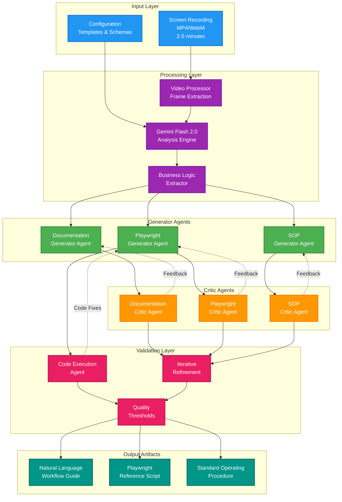

# Screen Recording Workflow Analyzer - Architecture Overview

## System Architecture Diagram

## Component Responsibilities

### Input Layer
- **Screen Recording**: Raw video input containing browser workflow
- **Configuration**: Templates, schemas, and processing parameters

### Processing Layer
- **Video Processor**: Frame extraction and preprocessing
- **Gemini Flash 2.0**: Core AI analysis engine for multimodal processing
- **Business Logic Extractor**: Specialized component for decision pattern recognition

### Generator Agents
- **Documentation Generator**: Creates natural language workflow descriptions
- **Playwright Generator**: Produces automation script templates
- **SOP Generator**: Builds compliance documentation

### Critic Agents
- **Documentation Critic**: Validates accuracy and completeness of workflow descriptions
- **Playwright Critic**: Reviews script quality and viability
- **SOP Critic**: Ensures compliance with industry standards

### Validation Layer
- **Code Execution Agent**: Tests and debugs generated scripts
- **Quality Thresholds**: Configurable acceptance criteria
- **Iterative Refinement**: Orchestrates improvement cycles

### Output Artifacts
- **Natural Language Guide**: Human-readable workflow with metadata
- **Playwright Script**: Automation code template
- **Standard Operating Procedure**: Compliance documentation