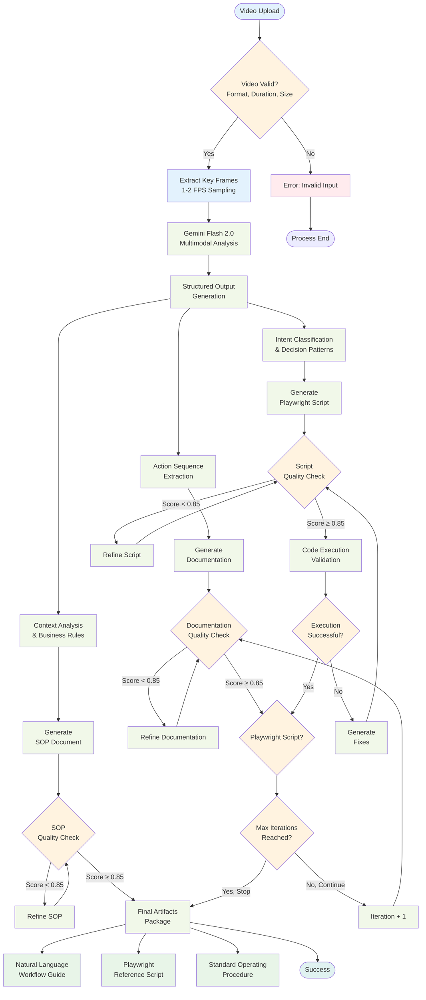

# Screen Recording Workflow Analyzer - Data Flow Pipeline

## Data Processing Flow

## Data Flow Specifications

### Input Validation
- **Format Check**: MP4, WebM, AVI formats supported
- **Duration Limits**: 2-5 minute recordings only
- **Quality Thresholds**: Minimum resolution and frame rate requirements

### Analysis Pipeline
- **Frame Sampling**: Extract key frames at 1-2 FPS for efficiency
- **Multimodal Processing**: Combine visual and audio analysis
- **Structured Output**: JSON schema-compliant data extraction

### Business Logic Processing
- **Action Sequencing**: Chronological workflow step identification
- **Intent Classification**: Purpose and reasoning behind each action
- **Context Analysis**: Environmental factors and business rules

### Quality Assurance Flow
- **Iterative Refinement**: Up to 3 improvement cycles per artifact
- **Quality Thresholds**: Configurable acceptance criteria (default 0.85)
- **Code Validation**: Special handling for executable scripts

### Convergence Criteria
- **Score Threshold**: All artifacts must achieve minimum quality score
- **Iteration Limit**: Maximum refinement cycles to prevent infinite loops
- **Manual Override**: Option for human review and approval

### Output Generation
- **Parallel Processing**: All three artifacts generated simultaneously
- **Version Control**: Track refinement iterations and changes
- **Validation Evidence**: Include quality scores and critique feedback