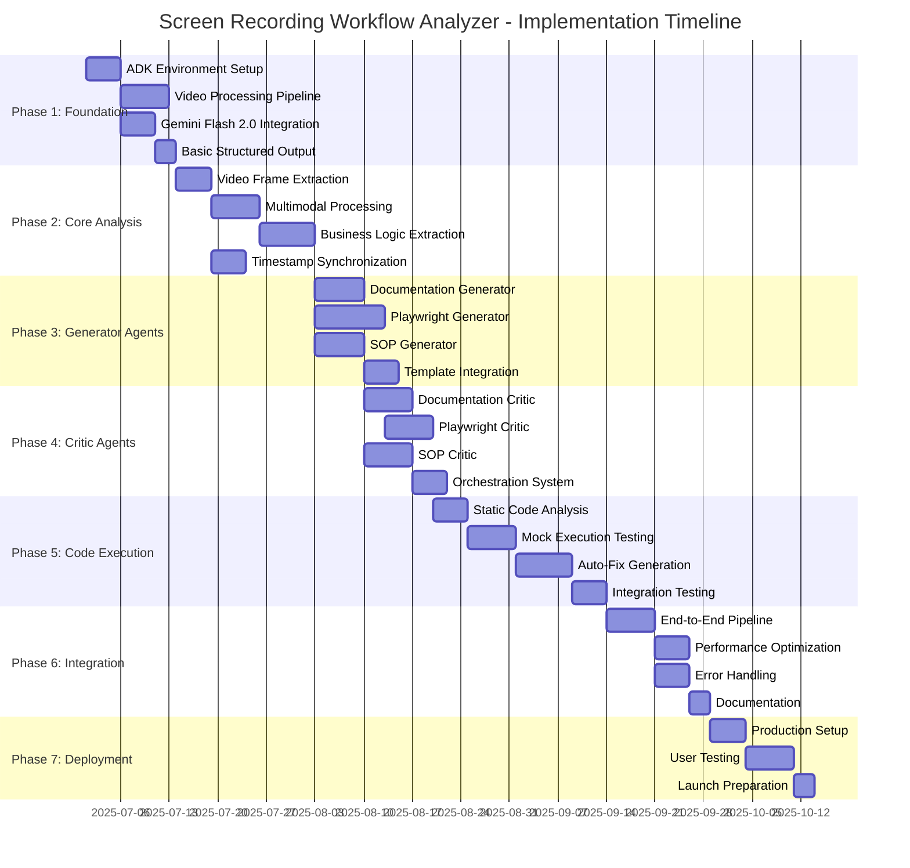

# Screen Recording Workflow Analyzer - Implementation Phases

## Project Timeline & Dependencies

## Phase Dependencies & Milestones

```mermaid
graph LR
    subgraph "Phase 1: Foundation (Weeks 1-2)"
        P1A[ADK Setup] --> P1B[Video Pipeline]
        P1A --> P1C[Gemini Integration]
        P1C --> P1D[Structured Output]
        P1B --> P1D
    end

    subgraph "Phase 2: Core Analysis (Weeks 3-4)"
        P2A[Frame Extraction] --> P2B[Multimodal Processing]
        P2B --> P2C[Business Logic]
        P2A --> P2D[Timestamp Sync]
    end

    subgraph "Phase 3: Generators (Weeks 5-7)"
        P3A[Doc Generator]
        P3B[Playwright Generator]
        P3C[SOP Generator]
        P3C --> P3D[Template Integration]
    end

    subgraph "Phase 4: Critics (Weeks 8-10)"
        P4A[Doc Critic]
        P4B[Playwright Critic]
        P4C[SOP Critic]
        P4A --> P4D[Orchestrator]
        P4B --> P4D
        P4C --> P4D
    end

    subgraph "Phase 5: Code Execution (Weeks 11-12)"
        P5A[Static Analysis] --> P5B[Mock Execution]
        P5B --> P5C[Auto-Fix]
        P5C --> P5D[Integration]
    end

    subgraph "Phase 6: Integration (Weeks 13-14)"
        P6A[E2E Pipeline] --> P6B[Optimization]
        P6A --> P6C[Error Handling]
        P6B --> P6D[Documentation]
        P6C --> P6D
    end

    subgraph "Phase 7: Deployment (Weeks 15-16)"
        P7A[Production] --> P7B[Testing]
        P7B --> P7C[Launch]
    end

    %% Cross-phase dependencies
    P1D --> P2A
    P2C --> P3A
    P2C --> P3B
    P2C --> P3C
    P3A --> P4A
    P3B --> P4B
    P3C --> P4C
    P4B --> P5A
    P4D --> P6A
    P5D --> P6A
    P6D --> P7A

    %% Styling
    classDef phase1 fill:#e3f2fd
    classDef phase2 fill:#f1f8e9
    classDef phase3 fill:#fff3e0
    classDef phase4 fill:#fce4ec
    classDef phase5 fill:#e8eaf6
    classDef phase6 fill:#e0f2f1
    classDef phase7 fill:#fff8e1

    class P1A,P1B,P1C,P1D phase1
    class P2A,P2B,P2C,P2D phase2
    class P3A,P3B,P3C,P3D phase3
    class P4A,P4B,P4C,P4D phase4
    class P5A,P5B,P5C,P5D phase5
    class P6A,P6B,P6C,P6D phase6
    class P7A,P7B,P7C phase7
```

## Critical Path Analysis

### Phase 1-2: Foundation (Weeks 1-4)
**Critical Path**: ADK Setup → Gemini Integration → Video Processing → Business Logic Extraction
- **Risk**: ADK access delays could impact entire timeline
- **Mitigation**: Parallel team training and environment preparation

### Phase 3-4: Agent Development (Weeks 5-10)
**Critical Path**: Business Logic → Generators → Critics → Orchestrator
- **Risk**: Generator complexity may impact critic development
- **Mitigation**: Modular development with well-defined interfaces

### Phase 5-6: Validation & Integration (Weeks 11-14)
**Critical Path**: Code Execution → Integration → Performance Testing
- **Risk**: Performance bottlenecks may require architecture changes
- **Mitigation**: Early performance testing and optimization planning

### Phase 7: Deployment (Weeks 15-16)
**Critical Path**: Production Setup → User Testing → Launch
- **Risk**: User feedback may require significant changes
- **Mitigation**: Continuous stakeholder involvement and iterative testing

## Resource Allocation by Phase

| Phase | Lead Developer | ML Engineer | QA Engineer | Business Analyst |
|-------|---------------|-------------|-------------|-------------------|
| 1-2   | 100%         | 80%         | 20%         | 40%              |
| 3-4   | 100%         | 60%         | 60%         | 60%              |
| 5-6   | 80%          | 40%         | 100%        | 40%              |
| 7     | 60%          | 20%         | 80%         | 80%              |

## Success Criteria by Phase

### Phase Completion Gates
1. **Foundation**: Successful video analysis with structured output
2. **Core Analysis**: Business logic extraction achieving >70% accuracy
3. **Generators**: All three artifacts generating with basic quality
4. **Critics**: Quality validation system achieving >80% accuracy
5. **Code Execution**: Playwright scripts passing basic execution tests
6. **Integration**: End-to-end workflow processing complete recordings
7. **Deployment**: Production system handling real-world workflows