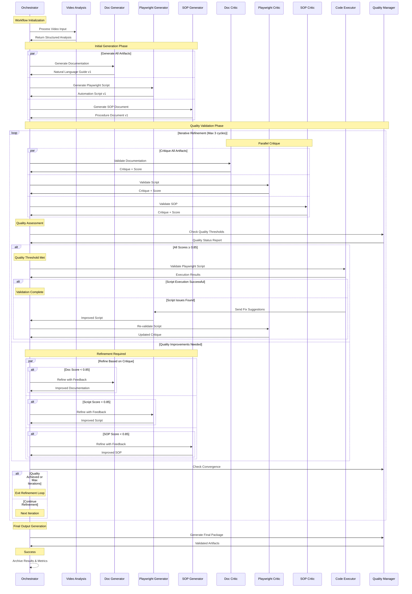

# Screen Recording Workflow Analyzer - Multi-Agent Workflow

## Generator-Critic Pattern Sequence

## Agent Interaction Patterns

### Orchestrator Agent
- **Role**: Workflow coordination and decision management
- **Responsibilities**: Task distribution, quality monitoring, convergence detection
- **Communication**: Coordinates all agent interactions and maintains state

### Generator Agents
- **Documentation Generator**: Creates natural language workflow descriptions
- **Playwright Generator**: Produces automation scripts with business logic
- **SOP Generator**: Builds compliance documentation following templates

### Critic Agents
- **Documentation Critic**: Validates accuracy, completeness, and clarity
- **Playwright Critic**: Reviews script structure, reliability, and best practices
- **SOP Critic**: Ensures compliance with industry standards and completeness

### Specialized Agents
- **Code Executor**: Tests script viability and suggests improvements
- **Quality Manager**: Monitors thresholds and manages convergence criteria

## Communication Protocols

### Message Types
- **Task Assignment**: Orchestrator → Generator/Critic
- **Artifact Delivery**: Generator → Orchestrator
- **Critique Feedback**: Critic → Orchestrator → Generator
- **Quality Assessment**: Quality Manager → Orchestrator
- **Refinement Request**: Orchestrator → Generator (with feedback)

### Quality Metrics Exchange
- **Confidence Scores**: 0.0 - 1.0 scale for each artifact
- **Issue Categories**: Critical, Major, Minor classification
- **Improvement Suggestions**: Specific actionable feedback
- **Validation Evidence**: Screenshots, logs, test results

### Convergence Signals
- **Quality Achieved**: All scores meet threshold criteria
- **Max Iterations**: Iteration limit reached (safety mechanism)
- **Manual Override**: Human intervention required
- **System Error**: Technical failure requiring escalation