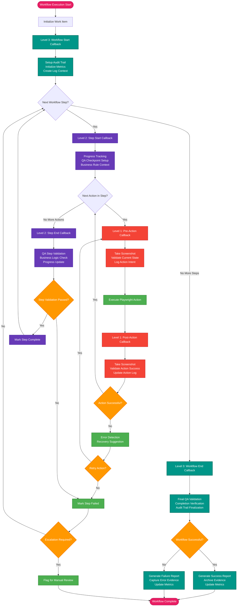

# AI Workflow Execution Agent - ADK Callback Flow

## Three-Level Callback Architecture



## Callback Level Specifications

### Level 1: Action-Level Callbacks (@callback.on_action)

#### Pre-Action Callback
```python
@callback.on_action(trigger="before")
def pre_action_callback(context):
    # Automatic screenshot capture
    screenshot_path = take_screenshot(f"before_{context.action_name}")
    
    # Validate current page state
    current_state = validate_page_state()
    
    # Log action intent
    log_action_intent(context.action_name, context.parameters)
    
    return {
        "screenshot": screenshot_path,
        "state_valid": current_state.is_valid,
        "ready_for_action": True
    }
```

#### Post-Action Callback
```python
@callback.on_action(trigger="after")
def post_action_callback(context, result):
    # Capture result screenshot
    screenshot_path = take_screenshot(f"after_{context.action_name}")
    
    # Validate action success
    success_validated = validate_action_result(context.action_name, result)
    
    # Update execution log
    update_action_log(context.action_name, result, success_validated)
    
    # Error detection
    if not success_validated:
        error_info = detect_action_errors()
        suggest_recovery_actions(error_info)
        
    return {
        "screenshot": screenshot_path,
        "success": success_validated,
        "error_info": error_info if not success_validated else None
    }
```

### Level 2: Step-Level Callbacks (@callback.on_step)

#### Step Start Callback
```python
@callback.on_step(trigger="start")
def step_start_callback(context):
    # Initialize step tracking
    progress_tracker.start_step(context.step_name)
    
    # Setup QA checkpoint
    qa_checkpoint = setup_qa_validation(context.step_requirements)
    
    # Load business rule context
    business_rules = load_business_rules(context.step_name)
    
    return {
        "step_id": generate_step_id(),
        "qa_checkpoint": qa_checkpoint,
        "business_rules": business_rules
    }
```

#### Step End Callback
```python
@callback.on_step(trigger="end")
def step_end_callback(context, step_results):
    # QA validation of step completion
    qa_result = qa_agent.validate_step_completion(
        step_name=context.step_name,
        actions_taken=step_results.actions,
        expected_outcome=context.expected_outcome
    )
    
    # Business logic compliance check
    compliance_check = validate_business_rules(
        step_results, context.business_rules
    )
    
    # Update progress tracking
    progress_tracker.complete_step(context.step_name, qa_result.success)
    
    return {
        "qa_validation": qa_result,
        "compliance": compliance_check,
        "step_success": qa_result.success and compliance_check.passed
    }
```

### Level 3: Workflow-Level Callbacks (@callback.on_workflow)

#### Workflow Start Callback
```python
@callback.on_workflow(trigger="start")
def workflow_start_callback(context):
    # Initialize audit trail
    audit_trail = AuditTrail(
        workflow_id=context.workflow_id,
        work_item=context.work_item,
        artifacts_used=context.workflow_artifacts
    )
    
    # Setup metrics collection
    metrics_collector = MetricsCollector(context.workflow_id)
    
    # Create execution log context
    execution_log = ExecutionLog(context.workflow_id)
    
    return {
        "audit_trail": audit_trail,
        "metrics_collector": metrics_collector,
        "execution_log": execution_log
    }
```

#### Workflow End Callback
```python
@callback.on_workflow(trigger="end")
def workflow_end_callback(context, workflow_results):
    # Final QA validation
    final_validation = qa_agent.validate_workflow_completion(
        workflow_results, context.success_criteria
    )
    
    # Generate completion evidence
    evidence_package = collect_completion_evidence(
        screenshots=context.screenshots,
        logs=context.execution_log,
        validation_results=final_validation
    )
    
    # Finalize audit trail
    audit_trail.finalize(
        success=final_validation.success,
        evidence=evidence_package,
        completion_time=datetime.now()
    )
    
    # Generate reports
    completion_report = generate_completion_report(
        work_item=context.work_item,
        success=final_validation.success,
        evidence=evidence_package
    )
    
    return {
        "final_validation": final_validation,
        "evidence_package": evidence_package,
        "completion_report": completion_report
    }
```

## Callback Integration Benefits

### Automated Quality Assurance
- **Continuous Validation**: Every action and step automatically validated
- **Real-time Error Detection**: Immediate identification of workflow deviations
- **Evidence Collection**: Automatic screenshot and log generation
- **Business Rule Compliance**: Automated verification against documented procedures

### Comprehensive Audit Trail
- **Complete Documentation**: Every action logged with context and validation
- **Visual Evidence**: Screenshots at key workflow points
- **Compliance Reporting**: Automated generation of audit-ready documentation
- **Traceability**: Full path from work item to completion with evidence

### Intelligent Error Recovery
- **Automatic Detection**: Callback-triggered error identification
- **Recovery Suggestions**: AI-powered recommendations for corrective actions
- **Retry Logic**: Intelligent retry mechanisms with learned patterns
- **Escalation Management**: Automated escalation when recovery fails

### Performance Optimization
- **Metrics Collection**: Automatic performance and quality data gathering
- **Pattern Recognition**: Learn from successful and failed workflows
- **Optimization Opportunities**: Identify bottlenecks and improvement areas
- **Quality Improvement**: Continuous enhancement through feedback loops