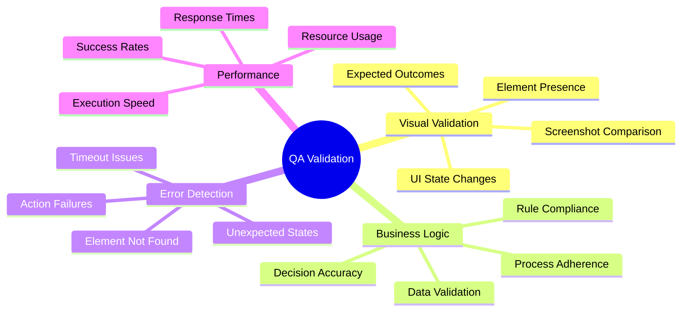
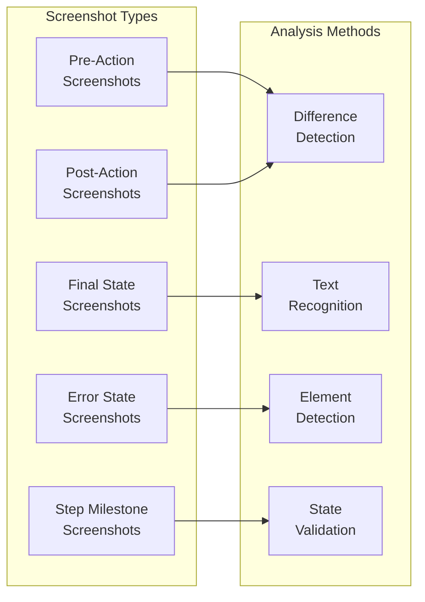
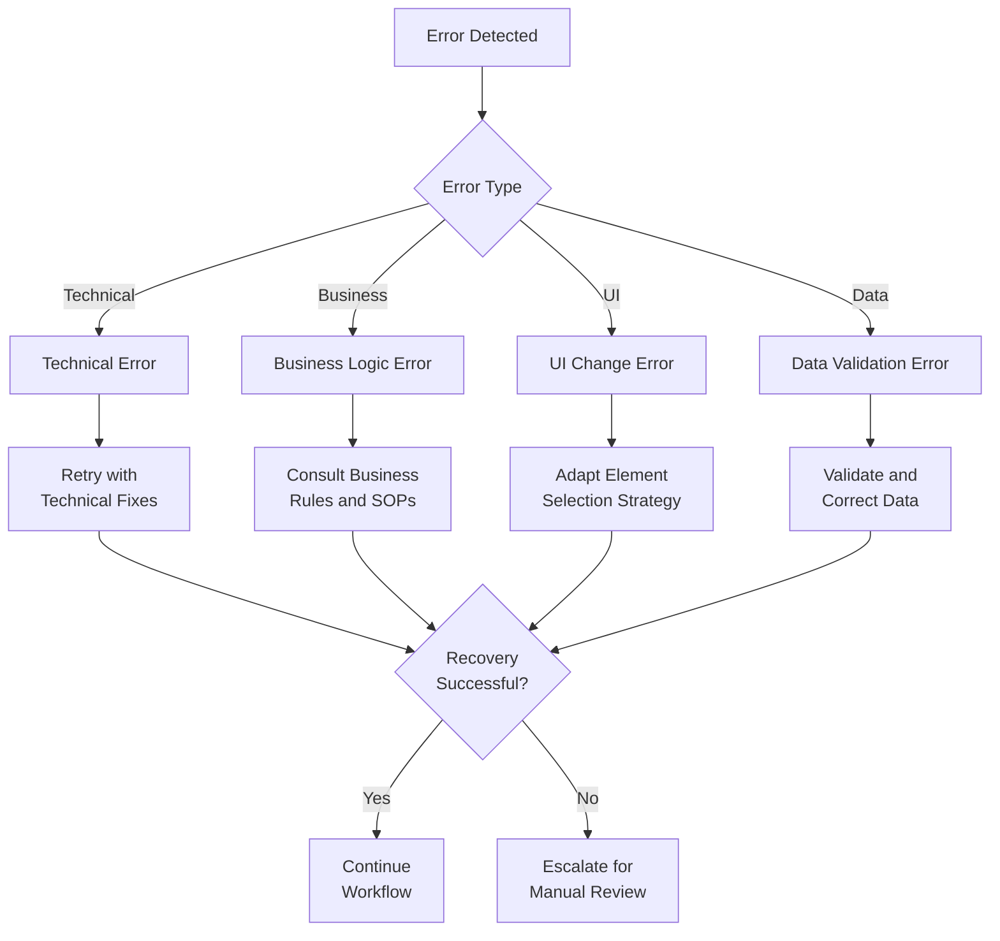

# AI Workflow Execution Agent - QA Validation Sequence

## QA Agent Interaction Flow

```mermaid
sequenceDiagram
    participant EA as Execution Agent
    participant CB as Callback System
    participant QA as QA Reasoning Agent
    participant SV as Screenshot Validator
    participant BV as Business Validator
    participant ER as Error Recovery
    participant AL as Audit Logger
    participant BR as Browser

    Note over EA,BR: Work Item Execution Start
    EA->>CB: Trigger Workflow Start Callback
    CB->>QA: Initialize QA Context
    QA->>AL: Setup Audit Trail
    QA-->>EA: QA System Ready

    Note over EA,BR: Step-by-Step Execution
    loop For Each Workflow Step
        EA->>CB: Trigger Step Start Callback
        CB->>QA: Setup Step Validation Context
        QA->>BV: Load Business Rules for Step
        BV-->>QA: Business Rules Context
        
        loop For Each Action in Step
            Note over EA,BR: Pre-Action Validation
            EA->>CB: Trigger Pre-Action Callback
            CB->>SV: Take Pre-Action Screenshot
            SV->>BR: Capture Page State
            BR-->>SV: Screenshot Captured
            SV->>QA: Validate Current State
            QA->>BV: Check Business Context
            BV-->>QA: Context Validation
            QA-->>CB: Pre-Action Validation Result
            CB-->>EA: Ready for Action
            
            Note over EA,BR: Action Execution
            EA->>BR: Execute Playwright Action
            BR-->>EA: Action Result
            
            Note over EA,BR: Post-Action Validation
            EA->>CB: Trigger Post-Action Callback
            CB->>SV: Take Post-Action Screenshot
            SV->>BR: Capture Updated State
            BR-->>SV: Screenshot Captured
            
            CB->>QA: Validate Action Completion
            QA->>SV: Analyze Screenshot Changes
            SV-->>QA: Visual Validation Result
            QA->>BV: Verify Business Logic Compliance
            BV-->>QA: Compliance Check Result
            
            alt Action Validation Successful
                QA->>AL: Log Successful Action
                QA-->>CB: Action Validated
                CB-->>EA: Continue to Next Action
            else Action Validation Failed
                QA->>ER: Request Error Analysis
                ER->>SV: Analyze Error Screenshots
                SV-->>ER: Error Context
                ER->>BV: Check Business Rule Violations
                BV-->>ER: Violation Analysis
                ER->>QA: Recovery Recommendations
                QA->>AL: Log Error and Recovery Plan
                QA-->>CB: Action Failed - Recovery Needed
                CB-->>EA: Execute Recovery Actions
                
                alt Recovery Successful
                    EA->>QA: Recovery Action Completed
                    QA-->>EA: Continue Workflow
                else Recovery Failed
                    QA->>AL: Log Unrecoverable Error
                    QA-->>EA: Escalate for Manual Review
                end
            end
        end
        
        Note over EA,BR: Step Completion Validation
        EA->>CB: Trigger Step End Callback
        CB->>QA: Validate Step Completion
        QA->>SV: Analyze Step Outcome Screenshots
        SV-->>QA: Step Visual Validation
        QA->>BV: Verify Step Business Logic
        BV-->>QA: Step Compliance Validation
        
        alt Step Validation Successful
            QA->>AL: Log Successful Step Completion
            QA-->>CB: Step Validated
            CB-->>EA: Continue to Next Step
        else Step Validation Failed
            QA->>ER: Analyze Step Failure
            ER-->>QA: Step Recovery Options
            alt Step Recovery Possible
                QA-->>EA: Execute Step Recovery
            else Step Recovery Not Possible
                QA->>AL: Log Step Failure
                QA-->>EA: Skip Step or Abort Workflow
            end
        end
    end

    Note over EA,BR: Workflow Completion Validation
    EA->>CB: Trigger Workflow End Callback
    CB->>QA: Validate Workflow Completion
    QA->>SV: Analyze Final State Screenshots
    SV-->>QA: Final Visual Validation
    QA->>BV: Verify Complete Business Process
    BV-->>QA: Final Compliance Check
    
    QA->>AL: Compile Final Evidence Package
    AL-->>QA: Evidence Package Ready
    
    alt Workflow Validation Successful
        QA->>AL: Log Successful Workflow Completion
        QA-->>EA: Workflow Completed Successfully
        EA->>AL: Generate Success Report
    else Workflow Validation Failed
        QA->>AL: Log Workflow Failure
        QA-->>EA: Workflow Failed Validation
        EA->>AL: Generate Failure Report
    end

    Note over EA,BR: Audit Trail Finalization
    AL->>AL: Finalize Audit Documentation
    AL-->>EA: Audit Trail Complete
```

## QA Validation Components

### QA Reasoning Agent
The central intelligence that orchestrates validation activities and makes quality decisions.

#### Responsibilities
- **Context Management**: Maintain awareness of workflow state and business requirements
- **Validation Orchestration**: Coordinate between visual, business, and error validation
- **Decision Making**: Determine success/failure and recovery strategies
- **Quality Scoring**: Assign confidence scores to validation results

#### Validation Criteria

### Screenshot Validator
Specialized component for visual verification of workflow progress.

#### Visual Analysis Capabilities
- **State Comparison**: Before/after screenshot analysis
- **Element Detection**: Verify presence and state of UI elements
- **Content Validation**: Confirm expected text, data, and visual changes
- **Error Identification**: Visual detection of error messages or unexpected states

#### Screenshot Organization

### Business Validator
Ensures workflow execution complies with documented business rules and procedures.

#### Business Rule Validation
- **Procedure Compliance**: Verify steps follow documented SOP
- **Decision Logic**: Validate business decisions match expected criteria
- **Data Integrity**: Ensure data processing follows business rules
- **Authorization**: Confirm proper approval and authorization workflows

#### Rule Types
- **Conditional Logic**: If-then business rules and branching logic
- **Validation Rules**: Data format, range, and consistency requirements
- **Approval Workflows**: Authorization and escalation procedures
- **Quality Standards**: Compliance with organizational standards

### Error Recovery System
Intelligent error detection and recovery recommendation engine.

#### Error Classification

#### Recovery Strategies
- **Adaptive Selectors**: Try alternative element selection methods
- **Timing Adjustments**: Modify wait times and retry intervals
- **Alternative Paths**: Use business logic to find alternative workflow routes
- **Data Correction**: Fix data format or validation issues automatically

## Quality Metrics and Reporting

### Real-time Quality Metrics
- **Validation Success Rate**: Percentage of actions/steps passing QA validation
- **Error Recovery Rate**: Percentage of errors successfully recovered
- **Business Compliance Score**: Adherence to documented procedures
- **Visual Validation Accuracy**: Screenshot analysis confidence scores

### Audit Trail Documentation
- **Action-Level Evidence**: Screenshots and validation results for each action
- **Step-Level Summaries**: Business rule compliance and outcome verification
- **Workflow-Level Reports**: Complete success/failure documentation with evidence
- **Quality Analytics**: Trends, patterns, and improvement opportunities

### Continuous Improvement
- **Pattern Recognition**: Learn from successful and failed validation scenarios
- **Rule Refinement**: Improve business rule detection and validation accuracy
- **Error Prevention**: Identify and prevent common error patterns
- **Optimization Opportunities**: Suggest workflow and validation improvements