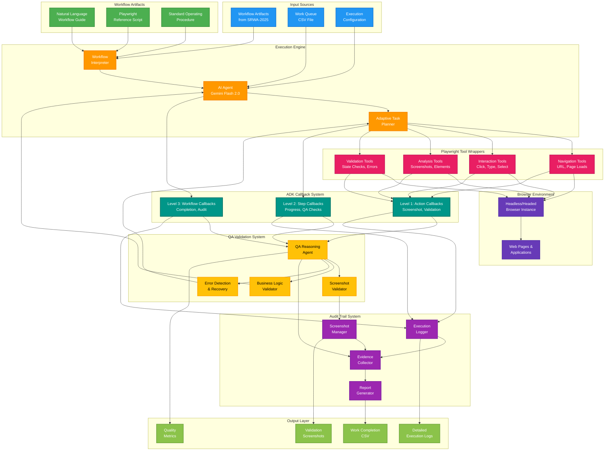

# AI Workflow Execution Agent - System Architecture

## System Architecture Overview

## Component Specifications

### Input Processing
- **Workflow Artifacts**: Consume and interpret SRWA-2025 generated training data
- **Work Queue**: Process CSV files with configurable column mapping
- **Configuration**: Execution parameters, quality thresholds, retry policies

### Execution Engine
- **AI Agent**: Gemini Flash 2.0 for intelligent decision-making and adaptation
- **Workflow Interpreter**: Parse and understand artifact guidance
- **Adaptive Task Planner**: Dynamic workflow execution with real-time adaptation

### Playwright Tool Wrappers
- **Navigation Tools**: URL navigation, page load management, redirect handling
- **Interaction Tools**: Element interaction with validation and error handling
- **Analysis Tools**: Page inspection, element discovery, content extraction
- **Validation Tools**: State verification, error detection, completion confirmation

### ADK Callback Integration
- **Level 1 (Action)**: Automatic screenshots, immediate validation, error detection
- **Level 2 (Step)**: Progress tracking, QA checkpoints, business rule validation
- **Level 3 (Workflow)**: Completion verification, audit trail generation, metrics collection

### QA Validation System
- **QA Reasoning Agent**: Intelligent assessment of workflow progress and quality
- **Screenshot Validator**: Visual confirmation of UI states and expected outcomes
- **Business Logic Validator**: Ensure compliance with documented procedures
- **Error Detection**: Real-time issue identification with recovery suggestions

### Audit Trail System
- **Execution Logger**: Comprehensive action and decision logging
- **Screenshot Manager**: Automated capture, labeling, and organization
- **Evidence Collector**: Aggregate validation artifacts and compliance data
- **Report Generator**: Create audit-ready documentation packages

## Integration Points

### SRWA-2025 Dependencies
- **Artifact Format**: Standardized structure for workflow guidance consumption
- **Quality Indicators**: Confidence scores and reliability metrics from source
- **Business Logic**: Decision criteria and procedural guidance integration

### Browser Environment
- **Multi-Browser Support**: Chromium, Firefox, Safari compatibility
- **Session Management**: Cookie handling, authentication, state persistence
- **Resource Optimization**: Efficient browser instance management and cleanup

### External Systems
- **Work Queue Sources**: Integration with ticketing systems, databases, APIs
- **Validation Endpoints**: External verification systems and data sources
- **Reporting Destinations**: Audit systems, compliance platforms, dashboards